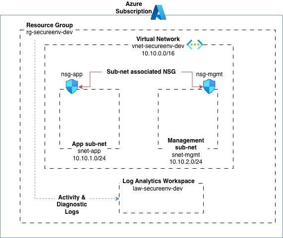

# Project: Secure Azure Environment using Terraform (IaC)

## Overview
This project deploys a secure, governed Azure baseline using Terraform (Infrastructure as Code).

It focuses on network security, least-privilege access, observability, governance, and cost control, aligned with real-world cloud engineering best practices.

The solution demonstrates not just how to deploy Azure infrastructure, but how to operate, monitor, and govern it safely at scale.

## Architecture
- Resource Group
- Virtual Network (10.10.0.0/16)
- Subnets:
  - snet-app (10.10.1.0/24)
  - snet-mgmt (10.10.2.0/24)
- Network Security Groups:
  - App subnet allows inbound HTTPS (443)
  - Mgmt subnet allows SSH (22) only from admin IP
- Log Analytics Workspace (centralised logging)

## Governance 
- Log Analytics Workspace (centralised logging)
- Azure Monitor Diagnostic Settings:
   - Subscription Activity Logs → Log Analytics
   - Network Security Group logs (where supported)
- Azure Key Vault (RBAC enabled)
- Azure Policy:
   - Required resource tags
   - Allowed deployment locations
- Azure Budget:
   - Monthly budget threshold
   - Forecast-based alerts

## Security choices
- Network security:
    - Segmentation: separates application workloads from management/admin zone
    - Least privilege inbound rules: only required ports are allowed
    - Restricted admin access: management access limited to a specific IP range
- Identity and secrets management:
    - Azure Key Vault used for secure secret storage
    - RBAC-based access control (no legacy access policies)
    - Secrets intentionally kept out of Terraform state
- Monitoring & audit:
    - Centralised observability via Azure Monitor and Log Analytics
    - Subscription Activity Logs captured for audit, troubleshooting, and security visibility
    - Resource-level diagnostics enabled where supported

## How to run locally
1. `az login`
2. Create `terraform.tfvars`:
   ```hcl
   admin_ip = "YOUR_IP/32"
3. terraform init
4. terraform plan
5. terraform apply

## Diagram



## CI / Automation
This project includes a GitHub Actions CI pipeline that automatically:
- Runs Terraform formatting (fmt) checks
- Validates configuration
- Authenticates to Azure
- Generates an infrastructure plan on push

This ensures infrastructure changes are reviewed and validated before deployment.

